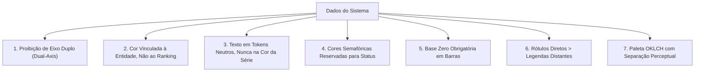

# Invariantes Matemáticos de Visualização de Dados (Dataviz)
**Referência Técnica:** `designer-ux-ui` & `javafx-dashboard`  
**Origem Metodológica:** Garimpo de System Prompts 2026-09 (`Anthropic/dataviz` + Edward Tufte / FT Visual Vocabulary)  
**Aplicação:** Telas analíticas, dashboards de KPIs, relatórios gerenciais e gráficos.

---

## 1. Princípio Fundamental

> Um gráfico existe para reduzir o esforço cognitivo do usuário na compreensão de grandezas, tendências e anomalias. Todo embelezamento que introduz ambiguidade perceptual ou ilusão estatística é um defeito de engenharia.

---

## 2. As 7 Regras Invariantes

### Regra 1: Proibição Estrita de Eixo Duplo (Dual-Axis)
- **O Defeito:** Colocar duas séries com grandezas ou unidades diferentes no mesmo gráfico com eixos Y independentes (esquerda e direita). A sobreposição e cruzamento das linhas dependem inteiramente das escalas arbitrárias escolhidas pelo programador, criando correlações espúrias.
- **A Solução:** Use **múltiplos pequenos empilhados** (`small multiples` / dois gráficos alinhados verticalmente compartilhando o mesmo eixo X) ou **normalize** os dados para uma base indexada (ex: Base 100 no início do período).

### Regra 2: Cor Vinculada à Entidade, NUNCA ao Ranking
- **O Defeito:** Pintar o "1º colocado" de azul, o "2º colocado" de verde e o "3º colocado" de laranja. Quando o filtro de mês muda e as posições trocam, as cores das entidades piscam e trocam de dono, desorientando o cérebro.
- **A Solução:** A cor é um identificador persistente da **entidade** (ex: Filial A é sempre grafite, Filial B é sempre azul), independentemente de estar em primeiro ou último lugar. Para destacar o líder, use peso tipográfico ou ordenação espacial, nunca troca de paleta.

### Regra 3: Texto Sempre em Tokens Neutros de Contraste
- **O Defeito:** Renderizar o valor numérico ou o rótulo da série na mesma cor da linha ou da barra (ex: texto amarelo em fundo branco para combinar com a linha amarela).
- **A Solução:** Texto sempre obedece aos tokens semânticos de tipografia da interface (`text-primary` ou `text-secondary`), garantindo contraste WCAG ≥ 4.5:1. A cor serve apenas para o glifo gráfico (a barra, o ponto ou o traço).

### Regra 4: Cores Semafóricas são Reservadas para Status
- **O Defeito:** Usar vermelho para indicar "Produtos da Categoria A" e verde para "Produtos da Categoria B" em um gráfico neutro. O usuário lê instantaneamente vermelho como "prejuízo/crítico" e verde como "lucro/ótimo".
- **A Solução:** Verde, amarelo/âmbar e vermelho são **reservados com exclusividade** para conformidade, saúde de operação e severidade. Séries de dados neutras devem usar azuis, cianos, grafites, violetas ou neutros tingidos.

### Regra 5: Base Zero Obrigatória em Gráficos de Barra
- **O Defeito:** Truncar o eixo de valor em gráfico de barras (ex: escala de 95 a 100 para fazer uma variação de 2% parecer um abismo de 500%).
- **A Solução:** Gráficos de barras codificam quantidade pelo comprimento e área da barra. A base do eixo de valor **DEVE ser zero**. Se a variação sutil for o foco, utilize um gráfico de linhas ou dispersão devidamente identificado.

### Regra 6: Rótulo Direto sobre Legenda Distante
- **O Defeito:** Gráfico com 3 linhas e uma legenda de caixas de cor no rodapé ou no topo direito, forçando o usuário a fazer varreduras oculares repetitivas de ida e volta para descobrir qual linha é qual.
- **A Solução:** Quando houver até 4 séries, posicione o rótulo da série diretamente ao final da respectiva linha (`direct labeling`). Elimina a legenda externa e acelera a cognição em 3x.

### Regra 7: Paleta no Espaço OKLCH com Separação Perceptual
- **O Defeito:** Escolher cores por valores hexadecimais aleatórios ou no espaço HSL, onde o amarelo tem luminância percebida 10x maior que o azul na mesma "saturação".
- **A Solução:** Defina a paleta categórica com luminosidade uniforme no espaço OKLCH, garantindo que nenhuma série se destaque inadvertidamente sobre as outras por ilusão óptica. Todas as combinações devem ser testadas em simuladores de protanopia, deuteranopia e tritanopia.
