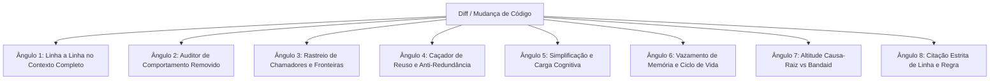

# Os 8 Ângulos de Code Review e Auditor de Comportamento Removido
**Referência Técnica:** `dev-senior` / Inspeção de Código  
**Origem Metodológica:** Garimpo de System Prompts 2026-09 (`Anthropic/code-review` adaptado com rigor de engenharia local)  
**Aplicação:** Revisões de PR, diffs substanciais, inspeção pós-refatoração e auditoria de qualidade.

---

## 1. Visão Geral dos 8 Ângulos

Ao conduzir uma revisão de código rigorosa, a inspeção superficial de linhas alteradas falha em identificar quebras sutis de invariantes e efeitos colaterais distantes. Os **8 Ângulos** fornecem uma varredura ortogonal onde cada eixo foca em uma dimensão crítica de qualidade e segurança:

---

## 2. Detalhamento dos 8 Ângulos

### Ângulo 1: Linha a Linha no Contexto da Função Completa
- **O que inspecionar:** Nunca avalie linhas adicionadas/alteradas isoladas no diff. Leia a função inteira do início ao fim.
- **Checagem:** Como as novas linhas afetam as variáveis locais anteriores? As pré-condições da função continuam sendo respeitadas? Há saídas antecipadas (`early return`) que deixam recursos sem limpeza?

### Ângulo 2: Auditor de Comportamento Removido (Crucial)
- **O que inspecionar:** Isole todas as linhas **removidas** (`-`) no diff.
- **Checagem:** 
  1. Para cada instrução, validação, verificação de nulo ou chamada de evento apagada: **onde esse comportamento foi restabelecido?**
  2. Se foi movido, o novo local executa sob as mesmas garantias de concorrência e transação?
  3. Se foi intencionalmente descartado, isso foi explicitamente pedido na especificação ou é uma regressão silenciosa?
- **Sinal de Perigo:** Remoção de validação de borda com a suposição de que "o chamador agora valida".

### Ângulo 3: Rastreio de Chamadores e Efeitos Inter-Arquivo
- **O que inspecionar:** Todas as chamadas para a função alterada e todas as funções que ela consome.
- **Checagem:**
  1. A assinatura mudou ou o tipo de retorno passou a aceitar nulo / `Optional`?
  2. Há novos efeitos colaterais (escrita em estado compartilhado, disparo assíncrono)?
  3. As suposições dos chamadores existentes foram invalidadas?

### Ângulo 4: Caçador de Reuso e Anti-Redundância
- **O que inspecionar:** Lógicas de formatação, cálculo, parseamento ou conversão adicionadas.
- **Checagem:** O repositório ou a biblioteca padrão já possui um utilitário, método estático ou classe helper que resolve exatamente isso? Evite a proliferação de reimplementações ad-hoc.

### Ângulo 5: Simplificação e Carga Cognitiva
- **O que inspecionar:** Níveis de aninhamento, nomes de variáveis e fluxo de controle.
- **Checagem:** 
  1. É possível aplicar cláusulas de guarda (`guard clauses`) para reduzir identação?
  2. Variáveis booleanas revelam intenção positiva (ex: `ativo` vs `naoInativo`)?
  3. Há código especulativo ou abstrações com implementação única (YAGNI)?

### Ângulo 6: Eficiência, Ciclo de Vida e Vazamento de Memória
- **O que inspecionar:** Closures, listeners, subscriptions, threads, pools e conexões de I/O.
- **Checagem:**
  1. Em lambdas/closures: a função anônima está capturando referências de objetos pesados que deveriam ser liberados pelo GC?
  2. Listeners registrados são desregistrados no fechamento do componente/tela?
  3. Conexões com banco, streams de arquivos e sockets utilizam `try-with-resources` ou bloco `finally` garantido?

### Ângulo 7: Altitude Causa-Raiz vs Bandaid
- **O que inspecionar:** Soluções de contorno como `catch (Exception e) {}`, checks de `if (x == null) return;` espalhados ou `Thread.sleep()`.
- **Checagem:** A alteração está curando a causa original do problema ou apenas silenciando o sintoma? Um bug de concorrência ou corrida de inicialização não pode ser "consertado" adicionando um atraso arbitrário.

### Ângulo 8: Citação Estrita de Linha, Regra e Solução Cirúrgica
- **O que reportar:** Todo apontamento deve ser autossuficiente e comprovável.
- **Formato Mandatório:**
  - **Local:** `<arquivo>:L<início>-L<fim>`
  - **Problema Concreto:** Explicação objetiva do defeito (com citação do invariante ou regra violada).
  - **Evidência/Cenário:** O caso de entrada que demonstra a falha.
  - **Proposta Cirúrgica:** Trecho de código com a correção mínima recomendada.

---

## 3. Protocolo de Aplicação

Ao ser solicitado para executar a revisão de 8 ângulos:
1. Extraia o diff limpo contra a base acordada.
2. Execute a varredura dos 8 eixos (podendo paralelizar via subagentes para os eixos ortogonais).
3. Consolide os achados agrupando por severidade (Crítica, Alta, Média, Baixa) com a citação estrita do Ângulo 8.
4. Se o Ângulo 2 (Comportamento Removido) identificar perda de invariante sem justificativa, a revisão é classificada como **REPROVADA** até esclarecimento.
