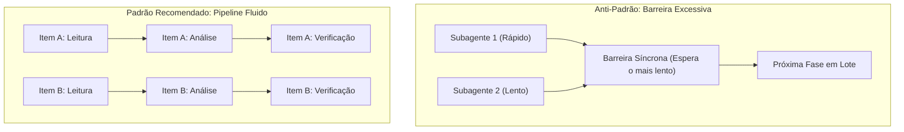

# Padrões Avançados de Orquestração Agentica e Refutação Adversarial
**Referência Técnica:** `orquestrador-fable` & `painel-de-juizes`  
**Origem Metodológica:** Garimpo de System Prompts 2026-09 (`Anthropic/workflow-authoring` + `batch`)  
**Aplicação:** Orquestração de subagentes, comitês de avaliação, varreduras de código e auditorias multi-modelo.

---

## 1. Princípio de Latência e Vazão: Pipeline vs Barreira

### Regra de Ouro: Pipeline é o Default
- Em processamento multi-tarefa, cada item deve avançar pelas suas etapas assim que estiver pronto. Não retenha itens rápidos esperando o item mais lento terminar a etapa 1.
- **Quando uma Barreira Síncrona é Legítima (Os 3 Casos Exclusivos):**
  1. *Desduplicação Cruzada Global:* Quando N agentes descobrem achados e você precisa desduplicar o conjunto consolidado antes de acionar uma etapa cara de verificação ou teste.
  2. *Saída Antecipada (Early Exit):* Se a soma total de itens for zero (ex: "zero regressões encontradas"), encerra o fluxo e pula todas as fases seguintes.
  3. *Síntese Comparativa:* Quando o prompt da etapa seguinte exige confrontar e ranquear as propostas umas contra as outras (como no `painel-de-juizes`).
  - *Checagem:* Se o código entre duas fases faz apenas um `map` ou `filter` simples item a item, a barreira é injustificada e deve virar pipeline.

---

## 2. Padrões de Verificação e Qualidade

### Padrão 1: Refutação Adversarial (Adversarial Verify)
- **O Problema:** Agentes consultados com perguntas complacentes ("este bug é real?", "está certo?") tendem ao viés de confirmação e respondem "sim".
- **A Solução:** Para cada hipótese ou achado crítico levantado, invoque avaliadores com instrução explícita de **REFUTAR**:
  > *"Sua missão exclusiva é derrubar esta alegação. Encontre o contraexemplo, a linha de código ou a condição de corrida que prova que esta hipótese é falsa ou que o bug não ocorre. Se tiver dúvida, considere refutado."*
- Um achado só é considerado verdadeiro se sobreviver à refutação cética por maioria (≥ 2 de 3).

### Padrão 2: Verificadores com Lentes Diversas
- Em vez de spawne N agentes genéricos repetindo o mesmo prompt, divida a banca em especialidades ortogonais:
  - Verificador 1: Corretude lógica e invariantes de domínio.
  - Verificador 2: Segurança e fronteiras de confiança.
  - Verificador 3: Reprodução prática e custo de runtime.
- Diversidade de perspectivas identifica modos de falha que a redundância homogênea não enxerga.

### Padrão 3: Ciclo até Esgotamento (Loop-until-dry)
- Para tarefas de descoberta com tamanho desconhecido (varredura de bugs, auditoria de cobertura, levantamento de requisitos):
- **Não limite por contagem arbitrária:** rodar "até achar 5 bugs" ignora a cauda longa de defeitos graves.
- **Mecanismo:** Mantenha rodadas sucessivas de exploração até que **K rodadas consecutivas** (ex: K = 2) resultem em zero achados líquidos-novos (satisfazendo também a RO-15).

### Padrão 4: Desduplicação contra Vistos (`seen`), NUNCA contra Confirmados
- Ao executar loops iterativos de busca e julgamento:
- **A Pegadinha:** Se você desduplicar novas propostas apenas contra os itens *confirmados*, os itens que os juízes *rejeitaram* na rodada 1 serão redescobertos e reenviados para julgamento na rodada 2, gerando um laço infinito de trabalho inútil.
- **A Regra:** Registre o hash ou chave única de **todo item já visto** (`seen = new Set()`), independentemente de ter sido aprovado ou reprovado. O filtro de novidade é sempre: `fresh = found.filter(item => !seen.has(key(item)))`.
